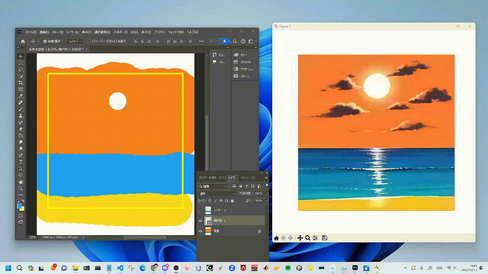
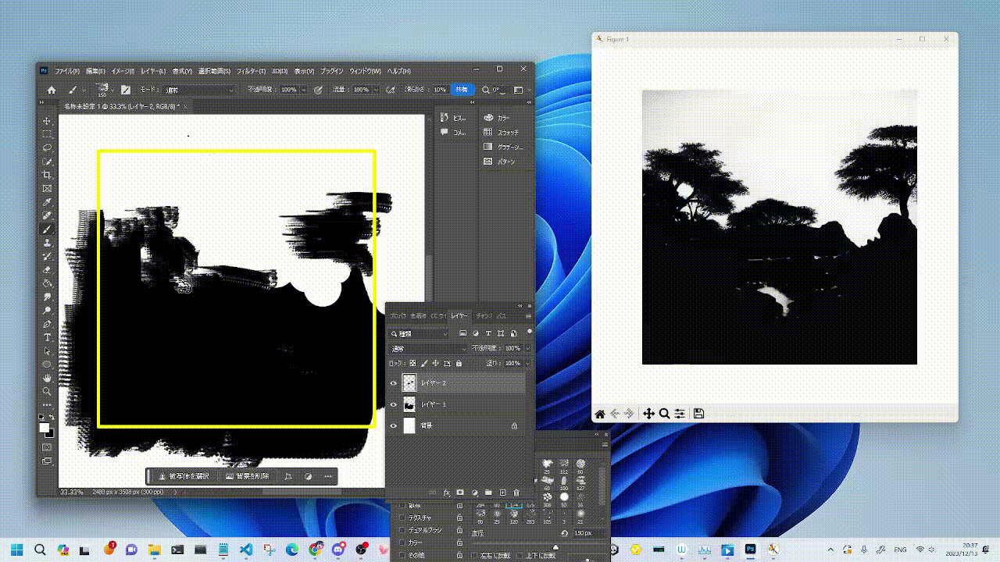
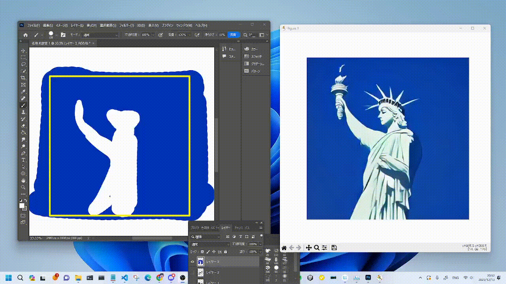
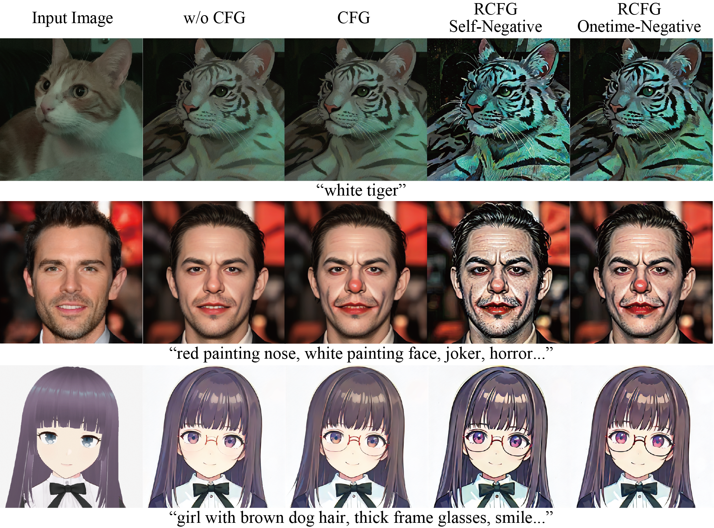

# StreamDiffusion - Jetson

A Streamdiffusion implementation for Nvidia Jetson - reaching 2fps generating 512x512 images.

Support for Jetpack 5.1.2 and compatibility with jetpack tensorrt 8.5.
Modifictions from original Streamdiffusion codebase:

- TensorRT 8.5 engine generation! - allow for trt speedup even with the older Jetson/ jetpack 5 tensorrt
- Python 3.8 compatibility
- Use of both Polygraphy and trtexec to generate compatible engine files (original implementation relies on trt > 8.6)
- CPU FP16 image denormalization
- Onnx generation with opset 14 for trt 8.5 compatibility
- Maximum image size set to 640 due to Jetson memory limits
- use ```polygraphy == 0.45``` for VAE conversion


<p align="center">
  
</p>

# StreamDiffusion: A Pipeline-Level Solution for Real-Time Interactive Generation

**Authors:** [Akio Kodaira](https://www.linkedin.com/in/akio-kodaira-1a7b98252/), [Chenfeng Xu](https://www.chenfengx.com/), Toshiki Hazama, [Takanori Yoshimoto](https://twitter.com/__ramu0e__), [Kohei Ohno](https://www.linkedin.com/in/kohei--ohno/), [Shogo Mitsuhori](https://me.ddpn.world/), [Soichi Sugano](https://twitter.com/toni_nimono), [Hanying Cho](https://twitter.com/hanyingcl), [Zhijian Liu](https://zhijianliu.com/), [Kurt Keutzer](https://scholar.google.com/citations?hl=en&user=ID9QePIAAAAJ)

StreamDiffusion is an innovative diffusion pipeline designed for real-time interactive generation. It introduces significant performance enhancements to current diffusion-based image generation techniques.

[](https://arxiv.org/abs/2312.12491)
[](https://huggingface.co/papers/2312.12491)

We sincerely thank [Taku Fujimoto](https://twitter.com/AttaQjp) and [Radamés Ajna](https://twitter.com/radamar) and Hugging Face team for their invaluable feedback, courteous support, and insightful discussions.

## Key Features

1. **Stream Batch**

   - Streamlined data processing through efficient batch operations.

2. **Residual Classifier-Free Guidance** - [Learn More](#residual-cfg-rcfg)

   - Improved guidance mechanism that minimizes computational redundancy.

3. **Stochastic Similarity Filter** - [Learn More](#stochastic-similarity-filter)

   - Improves GPU utilization efficiency through advanced filtering techniques.

4. **IO Queues**

   - Efficiently manages input and output operations for smoother execution.

5. **Pre-Computation for KV-Caches**

   - Optimizes caching strategies for accelerated processing.

6. **Model Acceleration Tools**
   - Utilizes various tools for model optimization and performance boost.

When images are produced using our proposed StreamDiffusion pipeline in an environment with **GPU: RTX 4090**, **CPU: Core i9-13900K**, and **OS: Ubuntu 22.04.3 LTS**.

|            model            | Denoising Step | fps on Txt2Img | fps on Img2Img |
| :-------------------------: | :------------: | :------------: | :------------: |
|          SD-turbo           |       1        |     106.16     |     93.897     |
| LCM-LoRA <br>+<br> KohakuV2 |       4        |     38.023     |     37.133     |

Feel free to explore each feature by following the provided links to learn more about StreamDiffusion's capabilities. If you find it helpful, please consider citing our work:

```bash
@article{kodaira2023streamdiffusion,
      title={StreamDiffusion: A Pipeline-level Solution for Real-time Interactive Generation},
      author={Akio Kodaira and Chenfeng Xu and Toshiki Hazama and Takanori Yoshimoto and Kohei Ohno and Shogo Mitsuhori and Soichi Sugano and Hanying Cho and Zhijian Liu and Kurt Keutzer},
      year={2023},
      eprint={2312.12491},
      archivePrefix={arXiv},
      primaryClass={cs.CV}
}
```

## Installation

### Step0: clone this repository

```bash
git clone https://github.com/cumulo-autumn/StreamDiffusion.git
```

### Step1: Make Environment

You can install StreamDiffusion via pip, conda, or Docker(explanation below).

```bash
conda create -n streamdiffusion python=3.10
conda activate streamdiffusion
```

OR

```cmd
python -m venv .venv
# Windows
.\.venv\Scripts\activate
# Linux
source .venv/bin/activate
```

### Step2: Install PyTorch

Select the appropriate version for your system.

CUDA 11.8

```bash
pip3 install torch==2.1.0 torchvision==0.16.0 xformers --index-url https://download.pytorch.org/whl/cu118
```

CUDA 12.1

```bash
pip3 install torch==2.1.0 torchvision==0.16.0 xformers --index-url https://download.pytorch.org/whl/cu121
```

details: https://pytorch.org/

### Step3: Install StreamDiffusion

#### For User

Install StreamDiffusion

```bash
#for Latest Version (recommended)
pip install git+https://github.com/cumulo-autumn/StreamDiffusion.git@main#egg=streamdiffusion[tensorrt]


#or


#for Stable Version
pip install streamdiffusion[tensorrt]
```

Install TensorRT extension

```bash
python -m streamdiffusion.tools.install-tensorrt
```

(Only for Windows) You may need to install pywin32 additionally, if you installed Stable Version(`pip install streamdiffusion[tensorrt]`).

```bash
pip install --force-reinstall pywin32
```

#### For Developer

```bash
python setup.py develop easy_install streamdiffusion[tensorrt]
python -m streamdiffusion.tools.install-tensorrt
```

### Docker Installation (TensorRT Ready)

```bash
git clone https://github.com/cumulo-autumn/StreamDiffusion.git
cd StreamDiffusion
docker build -t stream-diffusion:latest -f Dockerfile .
docker run --gpus all -it -v $(pwd):/home/ubuntu/streamdiffusion stream-diffusion:latest
```

## Quick Start

You can try StreamDiffusion in [`examples`](./examples) directory.

|  |  |
| :----------------------------: | :----------------------------: |
|  |  |

## Real-Time Txt2Img Demo

There is an interactive txt2img demo in [`demo/realtime-txt2img`](./demo/realtime-txt2img) directory!

<p align="center">
  
</p>

## Real-Time Img2Img Demo

There is a real time img2img demo with a live webcam feed or screen capture on a web browser in [`demo/realtime-img2img`](./demo/realtime-img2img) directory!

<p align="center">
  
</p>

## Usage Example

We provide a simple example of how to use StreamDiffusion. For more detailed examples, please refer to [`examples`](./examples) directory.

### Image-to-Image

```python
import torch
from diffusers import AutoencoderTiny, StableDiffusionPipeline
from diffusers.utils import load_image

from streamdiffusion import StreamDiffusion
from streamdiffusion.image_utils import postprocess_image

# You can load any models using diffuser's StableDiffusionPipeline
pipe = StableDiffusionPipeline.from_pretrained("KBlueLeaf/kohaku-v2.1").to(
    device=torch.device("cuda"),
    dtype=torch.float16,
)

# Wrap the pipeline in StreamDiffusion
stream = StreamDiffusion(
    pipe,
    t_index_list=[32, 45],
    torch_dtype=torch.float16,
)

# If the loaded model is not LCM, merge LCM
stream.load_lcm_lora()
stream.fuse_lora()
# Use Tiny VAE for further acceleration
stream.vae = AutoencoderTiny.from_pretrained("madebyollin/taesd").to(device=pipe.device, dtype=pipe.dtype)
# Enable acceleration
pipe.enable_xformers_memory_efficient_attention()


prompt = "1girl with dog hair, thick frame glasses"
# Prepare the stream
stream.prepare(prompt)

# Prepare image
init_image = load_image("assets/img2img_example.png").resize((512, 512))

# Warmup >= len(t_index_list) x frame_buffer_size
for _ in range(2):
    stream(init_image)

# Run the stream infinitely
while True:
    x_output = stream(init_image)
    postprocess_image(x_output, output_type="pil")[0].show()
    input_response = input("Press Enter to continue or type 'stop' to exit: ")
    if input_response == "stop":
        break
```

### Text-to-Image

```python
import torch
from diffusers import AutoencoderTiny, StableDiffusionPipeline

from streamdiffusion import StreamDiffusion
from streamdiffusion.image_utils import postprocess_image

# You can load any models using diffuser's StableDiffusionPipeline
pipe = StableDiffusionPipeline.from_pretrained("KBlueLeaf/kohaku-v2.1").to(
    device=torch.device("cuda"),
    dtype=torch.float16,
)

# Wrap the pipeline in StreamDiffusion
# Requires more long steps (len(t_index_list)) in text2image
# You recommend to use cfg_type="none" when text2image
stream = StreamDiffusion(
    pipe,
    t_index_list=[0, 16, 32, 45],
    torch_dtype=torch.float16,
    cfg_type="none",
)

# If the loaded model is not LCM, merge LCM
stream.load_lcm_lora()
stream.fuse_lora()
# Use Tiny VAE for further acceleration
stream.vae = AutoencoderTiny.from_pretrained("madebyollin/taesd").to(device=pipe.device, dtype=pipe.dtype)
# Enable acceleration
pipe.enable_xformers_memory_efficient_attention()


prompt = "1girl with dog hair, thick frame glasses"
# Prepare the stream
stream.prepare(prompt)

# Warmup >= len(t_index_list) x frame_buffer_size
for _ in range(4):
    stream()

# Run the stream infinitely
while True:
    x_output = stream.txt2img()
    postprocess_image(x_output, output_type="pil")[0].show()
    input_response = input("Press Enter to continue or type 'stop' to exit: ")
    if input_response == "stop":
        break
```

You can make it faster by using SD-Turbo.

### Faster generation

Replace the following code in the above example.

```python
pipe.enable_xformers_memory_efficient_attention()
```

To

```python
from streamdiffusion.acceleration.tensorrt import accelerate_with_tensorrt

stream = accelerate_with_tensorrt(
    stream, "engines", max_batch_size=2,
)
```

It requires TensorRT extension and time to build the engine, but it will be faster than the above example.

## Optionals

### Stochastic Similarity Filter


Stochastic Similarity Filter reduces processing during video input by minimizing conversion operations when there is little change from the previous frame, thereby alleviating GPU processing load, as shown by the red frame in the above GIF. The usage is as follows:

```python
stream = StreamDiffusion(
    pipe,
    [32, 45],
    torch_dtype=torch.float16,
)
stream.enable_similar_image_filter(
    similar_image_filter_threshold,
    similar_image_filter_max_skip_frame,
)
```

There are the following parameters that can be set as arguments in the function:

#### `similar_image_filter_threshold`

- The threshold for similarity between the previous frame and the current frame before the processing is paused.

#### `similar_image_filter_max_skip_frame`

- The maximum interval during the pause before resuming the conversion.

### Residual CFG (RCFG)



RCFG is a method for approximately realizing CFG with competitive computational complexity compared to cases where CFG is not used. It can be specified through the cfg_type argument in the StreamDiffusion. There are two types of RCFG: one with no specified items for negative prompts RCFG Self-Negative and one where negative prompts can be specified RCFG Onetime-Negative. In terms of computational complexity, denoting the complexity without CFG as N and the complexity with a regular CFG as 2N, RCFG Self-Negative can be computed in N steps, while RCFG Onetime-Negative can be computed in N+1 steps.

The usage is as follows:

```python
# w/0 CFG
cfg_type = "none"
# CFG
cfg_type = "full"
# RCFG Self-Negative
cfg_type = "self"
# RCFG Onetime-Negative
cfg_type = "initialize"
stream = StreamDiffusion(
    pipe,
    [32, 45],
    torch_dtype=torch.float16,
    cfg_type=cfg_type,
)
stream.prepare(
    prompt="1girl, purple hair",
    guidance_scale=guidance_scale,
    delta=delta,
)
```

The delta has a moderating effect on the effectiveness of RCFG.

## Development Team

[Aki](https://twitter.com/cumulo_autumn),
[Ararat](https://twitter.com/AttaQjp),
[Chenfeng Xu](https://twitter.com/Chenfeng_X),
[ddPn08](https://twitter.com/ddPn08),
[kizamimi](https://twitter.com/ArtengMimi),
[ramune](https://twitter.com/__ramu0e__),
[teftef](https://twitter.com/hanyingcl),
[Tonimono](https://twitter.com/toni_nimono),
[Verb](https://twitter.com/IMG_5955),

(\*alphabetical order)
</br>

## Acknowledgements

The video and image demos in this GitHub repository were generated using [LCM-LoRA](https://huggingface.co/latent-consistency/lcm-lora-sdv1-5) + [KohakuV2](https://civitai.com/models/136268/kohaku-v2) and [SD-Turbo](https://arxiv.org/abs/2311.17042).

Special thanks to [LCM-LoRA authors](https://latent-consistency-models.github.io/) for providing the LCM-LoRA and Kohaku BlueLeaf ([@KBlueleaf](https://twitter.com/KBlueleaf)) for providing the KohakuV2 model and ,to [Stability AI](https://ja.stability.ai/) for [SD-Turbo](https://arxiv.org/abs/2311.17042).

KohakuV2 Models can be downloaded from [Civitai](https://civitai.com/models/136268/kohaku-v2) and [Hugging Face](https://huggingface.co/KBlueLeaf/kohaku-v2.1).

SD-Turbo is also available on [Hugging Face Space](https://huggingface.co/stabilityai/sd-turbo).

## Contributors

<a href="https://github.com/cumulo-autumn/StreamDiffusion/graphs/contributors">
  
</a>

## Pip list

```
Package                Version                 Editable project location
---------------------- ----------------------- ----------------------------
accelerate             0.25.0
aiohttp                3.9.5
aiosignal              1.3.1
annotated-types        0.6.0
antlr4-python3-runtime 4.9.3
anyio                  4.3.0
appdirs                1.4.4
async-timeout          4.0.3
attrs                  23.2.0
blinker                1.8.2
cbor2                  5.6.3
certifi                2024.2.2
charset-normalizer     3.3.2
click                  8.1.7
colored                1.4.4
coloredlogs            15.0.1
compel                 2.0.2
controlnet-aux         0.0.7
cuda-python            12.3.0
datasets               2.20.0
diffusers              0.24.0
dill                   0.3.8
docker                 7.0.0
DockerHub-API          0.5
einops                 0.8.0
evaluate               0.4.2
exceptiongroup         1.2.1
fastapi                0.110.0
filelock               3.12.2
fire                   0.6.0
Flask                  3.0.3
flatbuffers            23.5.26
frozenlist             1.4.1
fsspec                 2023.6.0
furl                   2.1.3
h11                    0.14.0
httptools              0.6.1
huggingface-hub        0.23.0
humanfriendly          10.0
idna                   3.7
imageio                2.34.1
importlib-metadata     6.8.0
itsdangerous           2.2.0
Jinja2                 3.1.2
lazy_loader            0.4
luma                   12
luma.core              2.4.2
luma.oled              3.13.0
markdown-it-py         3.0.0
markdown2              2.4.13
MarkupSafe             2.1.3
mdurl                  0.1.2
mpmath                 1.3.0
multidict              6.0.5
multiprocess           0.70.16
networkx               3.1
numpy                  1.24.4
nvidia-pyindex         1.0.9
omegaconf              2.3.0
onediff                1.0.0
oneflow                0.7.0
onnx                   1.14.0
onnx-graphsurgeon      0.3.26
onnxruntime-gpu        1.15.1
opencv-python          4.9.0.80
optimum                1.21.2
orderedmultidict       1.0.1
packaging              23.1
pandas                 2.0.3
peft                   0.9.0
pillow                 10.2.0
pip                    24.0
platformdirs           3.10.0
polygraphy             0.45.0
protobuf               4.23.4
psutil                 5.9.8
pyarrow                16.1.0
pyarrow-hotfix         0.6
pycparser              2.21
pycuda                 2022.2.2
pydantic               2.7.1
pydantic_core          2.18.2
pyftdi                 0.55.4
Pygments               2.15.1
pyparsing              3.0.9
pyserial               3.5
python-dateutil        2.9.0.post0
python-dotenv          1.0.1
python-rapidjson       1.10
pytools                2023.1.1
pytz                   2024.1
pyusb                  1.2.1
PyWavelets             1.4.1
PyYAML                 6.0.1
regex                  2023.6.3
requests               2.32.3
rich                   13.5.2
RPi.GPIO               0.7.1
safetensors            0.4.3
scikit-image           0.21.0
scipy                  1.10.1
sentencepiece          0.2.0
setuptools             69.5.1
six                    1.16.0
smbus2                 0.4.2
sniffio                1.3.1
spidev                 3.6
stable-fast            1.0.5
starlette              0.36.3
streamdiffusion        0.1.1                   /home/nvidia/StreamDiffusion
sympy                  1.12
termcolor              2.4.0
tifffile               2023.7.10
timm                   1.0.3
tokenizers             0.19.1
torch                  2.1.0a0+41361538.nv23.6
torch_tensorrt         1.4.0+7d1d80773
torchvision            0.15.0
tqdm                   4.66.4
transformers           4.41.0
tritonclient           2.35.0
typing_extensions      4.11.0
tzdata                 2024.1
urllib3                2.2.1
uvicorn                0.25.0
uvloop                 0.19.0
watchfiles             0.21.0
websockets             12.0
Werkzeug               3.0.3
wget                   3.2
wheel                  0.43.0
xxhash                 3.4.1
yarl                   1.9.4
zipp                   3.16.2
```